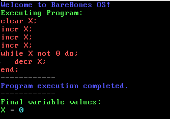
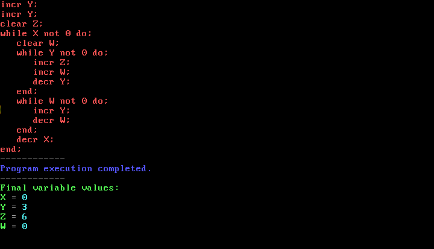
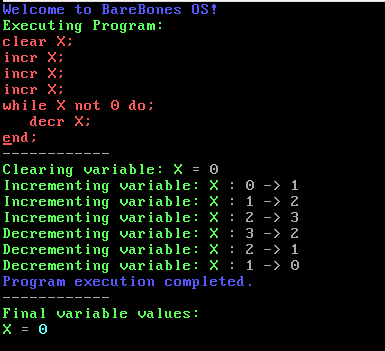

# Space Cadets Challenge 2 - BareBonesOS

[Challenge Reference](https://secure.ecs.soton.ac.uk/student/wiki/w/COMP1202/Space_Cadets/SCChallengeBareBones)

This is an operating system designed to run the Bare Bones language outlined in [Computer Science: An Overview](http://www.amazon.co.uk/Computer-Science-Overview-Glenn-Brookshear/dp/0321544285/ref=sr_1_1?ie=UTF8&s=books&qid=1225741559&sr=8-1).

The idea is this can run on basically any form of embedded system, given it does not rely on `libc`. This is written in C with basically no standard library. It has a custom memory pooling system and malloc system since I did not have access to heap allocation either. Also "terminal" output for VGA is managed through a custom handler. It also has various re-implementations of common libc functions like `sscanf` etc. It should also support multiboot aka it should also work with GRUB although I have not tested this yet.

The output display for this is VGA. I could change it to a monochrome display and be able to run this OS on a very small machine, which I should probably do at some point.

Overall, this was pretty fun to make, around ~1200 lines of code.

If you have any questions, let me know, although I doubt it.

# Showcase

## Basic Counter



## Multiplication Program



## Basic Counter with DEBUG=1



# Compilation

To compile this, use make. I tested this on wsl but im sure you can figure it out if you care enough.

```bash
make clean
make all DEBUG=0
make run
```

You can set `DEBUG=1` which creates a preprocessor definition `BBDEBUG` printing each increment and decrement in the log.
